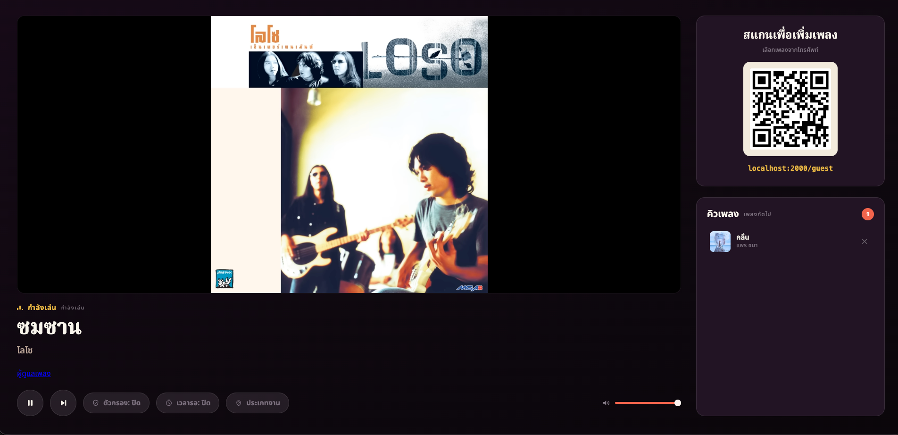
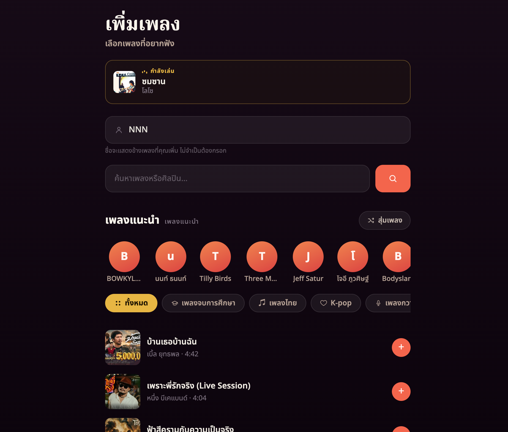

<div align="center">

# 🎶 Event Music System

**Turn any projector into a crowd-powered jukebox.**

Guests scan a QR code, search YouTube from their phones, and queue songs.
The music plays on the big screen — with an optional AI DJ that keeps requests
fit for the occasion, whatever the occasion is.

[](https://bun.sh)
[](LICENSE)
[](#how-it-works)
[](#run-on-a-home-server-docker--reverse-proxy)



<em>The projected host screen: player, scan-to-add QR, live queue with requester credits.</em>

</div>

## Why this exists

Party playlists die in one of two ways: one person DJs all night, or an
unmoderated queue fills with memes and worse. This is the middle path — every
guest can add songs from their own phone in seconds (no app, no account), while
the host keeps light-touch control: skip, remove, rate-limit, and an optional
LLM filter that understands *"this is a school dinner"* vs *"this is a
nightclub"* and judges requests accordingly.

Built for a real graduation dinner in Hong Kong; designed to work for any event.

## Features

- 📱 **Zero-friction requests** — scan QR → search → tap. No app, no login.
- 🔑 **No YouTube API key** — search scrapes the public results page; playback
  uses the standard embedded player.
- 🎤 **KTV-style explore** — genre tabs (K-pop, Cantopop, Mandopop, Western,
  party, Thai pop, classics) — Thailand charts load first (TH/th-TH) and singer chips with live, real results — guests who
  don't know what to pick just tap.
- 🤖 **AI content filter (optional)** — any OpenAI-compatible LLM judges each
  request against *your event*, enriched with the video's YouTube category,
  family-safe flag, and description. Three modes cycled from the host page:
  **off / on / strict**. Fails open on outages — moderation can never stop the
  music.
- 🎛 **Host controls, live** — play/pause/skip, volume, remove tracks, per-guest
  request cooldown, filter mode, and the event description fed to the AI — all
  from the projected page. Filter/cooldown/event settings persist across restarts; queue and playback are in memory.
- 🔒 **Host password** — required for Player/Admin and their WebSocket controls; guests remain public. Empty `HOST_PASSWORD` disables privileged pages/actions.
- 🛡 **Queue guardrails** — duplicate rejection, per-phone cooldown (works
  behind venue NAT), 50-song cap, playability pre-check, and a watchdog that
  skips videos that fail to start.
- ⚡ **Live everything** — one WebSocket broadcast keeps the projector and every
  phone in sync; guests see a "คุณ" badge on their own songs.

<div align="center">


<em>The guest page on a phone: Thai nickname, search, singer chips, one-tap requests.</em>
</div>

## Quick start

```bash
git clone https://github.com/attapon-th/event-music-system.git
cd event-music-system
bun install
cp .env.example .env      # set HOST_PASSWORD; the AI filter is off
bun start
```

Open **http://localhost:45416/** on the machine, drag it to the projector, and
sign in (any username, `HOST_PASSWORD` as the password), then click **เริ่มเล่น** once to unlock audio. Guests scan the on-screen QR code.

> Node ≥ 20 works too (`npm install && npm start`), but Bun is what the Docker
> image and scripts use.

## How it works

```
   Projector (laptop / server)        Guests' phones
  ┌────────────────────┐             ┌──────────────┐
  │  ▶ Now Playing     │   scan QR   │  🔍 search   │
  │  [ YouTube video ] │  ◀───────▶  │  + add song  │
  │  ▣ QR   Up Next ▤▤ │   Wi-Fi     │  live queue  │
  └────────────────────┘             └──────────────┘
            │ audio out → venue AV system
```

| Path | Purpose |
|------|---------|
| `/` | Host/projector page — player, QR code, queue, controls |
| `/guest` | Mobile page guests open via the QR |
| `/explore` | Alias of the Guest page with Thailand charts on first load |
| `/admin` | Password-protected remote controls, queue drag/drop, search and requests |
| `GET /api/host-token` | Basic-auth-protected WebSocket control token (not cached) |
| `GET /api/search?q=&mode=songs\|karaoke\|videos` | YouTube Music songs, karaoke or music videos (no API key) |
| `GET /api/browse?q=` | Cached, singles-only search behind the explore tabs |
| `POST /api/request` | Guardrails → playability check → (optional AI filter) → enqueue |
| WebSocket `/` | Broadcasts queue state; carries host controls |

The **server owns the queue** (`src/state.js`). The host page is just a player:
when a track ends or errors, it tells the server, which promotes the next song
and broadcasts the new state to everyone. Host-page settings (filter mode,
cooldown, event context) persist in `data/settings.json`.

Request pipeline: flood control → duplicate/cap checks → oEmbed playability
check → optional LLM verdict → enqueue. Embed-disabled or region-locked videos
that slip through are auto-skipped by the player (iframe error codes + a 20s
never-started watchdog).

## The AI filter

Off by default; cycle it from the host page (🛡 過濾 pill): **off → on →
strict**. It works with any **OpenAI-compatible** chat API — OpenRouter,
Kimi/Moonshot, DeepSeek, GLM… swap providers by changing three `.env` values,
no code changes:

```ini
LLM_API_KEY=sk-...
LLM_BASE_URL=https://openrouter.ai/api/v1
LLM_MODEL=deepseek/deepseek-v4-flash
```

Verify a key and list models with `bun run check-llm`.

**Context-aware, not puritanical.** Tell it what the event is (場景 button on
the host page — e.g. *"a wedding banquet"*, *"a nightclub party"*) and it sets
the bar accordingly: explicit mainstream tracks pass at a club but not at a
school dinner; national anthems and protest songs get caught at ordinary social
events. **Strict** mode ignores the venue and allows family-friendly music only.

Failure design worth knowing:

- **Fails open** on infrastructure problems (no key, HTTP error, network error) — an
  outage never stops the party.
- **Fails closed on timeout** with a retryable Thai message.
- **Fails closed** when the model answers but dodges the question (provider
  content-filter, no structured verdict) — evasion is treated as a rejection.

> The filter reads title, channel, category, and description — not the audio.
> By default it catches non-music and explicit metadata, not explicit lyrics
> hidden under a clean title. On OpenRouter, set `LLM_WEB_SEARCH=true` to close
> that gap: the model web-searches each song and judges the actual lyrics
> (~$0.005 per moderated request, a few seconds slower).

## Run on a home server (Docker + reverse proxy)

The server builds the image itself from source — no registry, no logins:

```bash
git clone https://github.com/attapon-th/event-music-system.git
cd event-music-system
cp .env.example .env          # set PUBLIC_URL to your domain, HOST_PASSWORD too
docker compose up -d --build
```

The container joins the external `reverseproxy` Docker network and exposes port
`45416`. Point your reverse proxy at `event-music:45416`, set `PUBLIC_URL` to
your domain (the QR code guests scan uses it), and make sure the proxy forwards
**WebSocket upgrades**. Host-page settings persist in `./data`.

> The `reverseproxy` network must already exist (it does if your proxy created
> it). If not: `docker network create reverseproxy`.

### Keeping it updated

**Push-to-deploy (recommended)** — a self-hosted GitHub Actions runner rebuilds
on every push to `main` (`.github/workflows/deploy.yml`). One-time setup:

1. **Register the runner** — repo → **Settings → Actions → Runners → New
   self-hosted runner**, pick Linux, run the shown commands on the home server
   as the user that owns your clone, then `sudo ./svc.sh install <youruser> &&
   sudo ./svc.sh start`.
2. **Docker access** — `sudo usermod -aG docker <youruser>` (re-login after).
3. **Clone location** — the workflow deploys `~/event-music-system` by default;
   set a repo Variable `DEPLOY_DIR` if yours lives elsewhere.

**Manual** — `git pull && docker compose up -d --build` whenever you like.
**Cron** — `update.sh` pulls and rebuilds only when something changed (use the
runner *or* cron, not both).

> **Security note:** self-hosted runners + a public repo need care. This
> workflow triggers only on direct pushes to `main` and manual dispatch — never
> on `pull_request` — so forks can't execute code on your runner. Keep it that
> way.

## ⚠️ The #1 thing that breaks at events: the network

Guests' phones must be able to reach the server. Many **venue/guest Wi-Fi
networks block device-to-device traffic** ("client isolation"), so the QR code
loads nothing even though everything is configured correctly.

Reliable fixes (pick one):

- **Host it publicly** behind a domain (the Docker setup above) — phones use
  their own data; nothing to debug at the venue.
- **Run your own hotspot** and have guests join it.
- **Bring a travel router** and put everyone on its network.

The host machine always needs internet for YouTube playback.

## Configuration

Everything lives in `.env` (see [`.env.example`](.env.example) for the full,
commented list). The highlights:

| Variable | What it does |
|----------|--------------|
| `PUBLIC_URL` | Public address the QR code points to (behind a reverse proxy) |
| `HOST_PASSWORD` | Required for Player/Admin pages + controls; empty disables both |
| `DEFAULT_REGION` | YouTube search/chart country, fallback `TH` |
| `DEFAULT_LOCALE` | YouTube language/locale, fallback `th-TH` |
| `LLM_API_KEY` / `LLM_BASE_URL` / `LLM_MODEL` | Any OpenAI-compatible provider for the filter |
| `EVENT_CONTEXT` | Initial event description for the AI (editable live) |
| `PORT` | Listen port (default `45416`) |

Filter state, moderation mode, cooldown, and event context are all editable
from the host page at runtime and persist in `data/settings.json` — `.env` only
seeds the first boot.

## Project layout

```
server.js                  Express + WebSocket server, request pipeline, settings
src/youtube.js             No-key search scraping, oEmbed check, watch-page details
src/moderation.js          LLM content filter (OpenAI-compatible, fail-open)
src/state.js               Authoritative in-memory queue
src/net.js                 LAN IP detection
public/host.*              Projector page (player, QR, controls)
public/guest.*             Mobile page (search, explore, live queue)
public/admin.*             Protected remote controls and queue drag/drop
public/i18n.js             Shared Thai UI dictionary + interpolation
scripts/test.mjs           HTTP/WebSocket integration checks (isolated temporary server)
scripts/check-llm.mjs      Verify LLM key + list models
Dockerfile                 Bun-based image
docker-compose.yml         Home-server deployment (builds locally)
update.sh                  Cron alternative: pull + rebuild if changed
```

No frameworks, no build step, three dependencies (`express`, `ws`, `qrcode`).


## ใช้งานระบบเพลงส่วนกลาง

ตั้งค่าใน `.env` ก่อนเปิด Player/Admin:

```ini
HOST_PASSWORD=your-password
DEFAULT_REGION=TH
DEFAULT_LOCALE=th-TH
```

เปิด `/` บน TV/TV Box เข้าสู่ระบบด้วยชื่อผู้ใช้ใดก็ได้และรหัส `HOST_PASSWORD`
แล้วกด **เริ่มเล่น** หนึ่งครั้งเพื่ออนุญาตเสียง เปิด `/admin` บนมือถือหรือคอมพิวเตอร์
เพื่อควบคุมเพลง ผู้ฟังเปิด `/guest` ค้นหาและเพิ่มเพลงได้โดยไม่ต้องเข้าสู่ระบบ
หน้า Guest มีลิงก์ไป Admin ซึ่งยังต้องเข้าสู่ระบบตามเดิม
หน้า Host ใช้ลูกศรรีโมตเลือกปุ่มและกด **OK/Enter** ได้ (ปุ่มเริ่มเล่นถูกเลือกไว้แล้ว)
ปรับเสียงด้วยซ้าย/ขวาขณะเลือกแถบเสียง ใช้ขึ้น/ลงเพื่อออกจากแถบเสียง
ปุ่มมุมขวาบนวิดีโอหรือ **F** เปิดวิดีโอเต็มจอ กด **OK** ที่ปุ่มเดิมหรือ **Back/Esc** เพื่อกลับ layout เดิม
Browser ที่ไม่มี Fullscreen API จะขยายวิดีโอเต็มพื้นที่หน้าเว็บแทน รองรับปุ่มสื่อเล่น/หยุดและข้ามเพลงด้วย
Guest/Admin แยก **ค้นหาเพลง** และ **คิวเพลง** เป็นคนละแท็บ โดยคิวยังอัปเดตสดขณะอยู่แท็บค้นหา
กดปุ่มโหมด **วิดีโอเพลง / คาราโอเกะ / เพลง** ได้ในแท็บค้นหา โดย Guest/Admin เริ่มต้นที่ **วิดีโอเพลง**: เพลงใช้ YouTube Music หมวด Songs
ส่วนคาราโอเกะใช้วิดีโอ YouTube และเติมคำว่า `karaoke` หากคำค้นยังไม่มีคำนี้หรือ “คาราโอเกะ”
วิดีโอเพลงค้นหาวิดีโอ YouTube โดยเติม `official music video` หากยังไม่ได้ระบุในคำค้น
Guest และ Admin มีเพลงแนะนำ หมวดเพลง ปุ่มศิลปิน และปุ่มสุ่มเหมือนกัน ใช้โหมดที่เลือกด้วย ทุกโหมดเพิ่มเข้าคิวเดียวกันและเล่นบน Player เดิม
`/api/search` และ `/api/browse` รองรับ `mode=songs` (ค่าเริ่มต้น) หรือ `mode=karaoke` / `mode=videos`

Guest/Admin สุ่มชื่อเล่นภาษาไทยจาก 100 ชื่อ เก็บไว้ใน browser และแสดง “เพิ่มเพลง โดย {nickname}”
ชื่อเล่นนี้ส่งเป็นชื่อผู้เพิ่มเพลงโดยไม่ต้องกรอกเอง ผลค้นหาและเพลงแนะนำแสดงครั้งละ 5 เพลง
กด **เพลงเพิ่มเติม** เพื่อแสดงเพิ่มอีกไม่เกิน 5 เพลง คิวเพลงยังแสดงครบ
ค้นหาเพลงต่างประเทศได้ตามปกติ ชาร์ตประเทศเลือกจาก YouTube ตาม `DEFAULT_REGION`
UI ใช้ภาษาไทยเป็นหลักและอังกฤษเป็นคำรอง ไม่มีข้อความจีนใน UI ที่กำหนดไว้
ข้อความอยู่ใน `public/i18n.js` และใช้ชื่อศิลปินอังกฤษในปุ่มแนะนำ
ชื่อเพลงและข้อมูลศิลปินจาก YouTube แสดงตามต้นฉบับ

Admin แสดงชื่อเพลง รูป ระยะเวลาและชื่อผู้เพิ่ม รองรับลากจัดลำดับด้วยเมาส์/สัมผัส
และมีปุ่มเลื่อนขึ้น/ลงสำหรับคีย์บอร์ด **ล้างคิว** ลบเฉพาะเพลงที่รอ
**เล่นตอนนี้** เปลี่ยนเพลงปัจจุบันเป็นเพลงที่เลือก และเก็บเพลงที่เหลือไว้ตามลำดับเดิม
รีเฟรชหน้าแล้วรับ snapshot ปัจจุบันจาก server ทันที แต่ restart server จะล้าง queue
ตามพฤติกรรมเดิม ระบบใช้ Player หนึ่งเครื่องเป็นแหล่งเสียง

### API และ WebSocket

ใช้ HTTP API เดิมสำหรับค้นหา/เพิ่มเพลง ไม่มี Admin queue REST API แยกชุด
`/api/info` เพิ่ม `defaultRegion` และ `defaultLocale` ส่วน `/api/browse?q=__hits`
โหลดชาร์ตประเทศ (`__hk_hits` ยังรองรับสำหรับ client เดิมและใช้ประเทศที่ตั้งค่า)

WebSocket `/` ต้องส่ง `{ "type": "auth", "token": "..." }` จาก `/api/host-token`
ก่อนควบคุม server ตอบ `{ "type": "auth", "ok": true/false }`
ทุก socket เริ่มต้นอ่านอย่างเดียว รวมถึงเมื่อไม่ได้ตั้งรหัสผ่าน

| Event | Payload / ผลลัพธ์ |
| --- | --- |
| `state` | Snapshot เดิมเพิ่ม `state.paused` และ `state.volume` (0–100) |
| `reorder` | `{ ids: [queueItemId, ...] }` ต้องเป็น ID ครบทุกเพลง ห้ามซ้ำ; stale order ถูกปฏิเสธ |
| `clear` | ล้างเพลงที่รอทั้งหมด |
| `playNow` | `{ id }` เปลี่ยนไปเล่นเพลงในคิวทันที |
| `play` / `pause` | เปลี่ยนสถานะการเล่น แล้ว Player ใช้ IFrame API ตาม snapshot |
| `setVolume` | `{ volume: 0–100 }` ปรับเสียงทุก Player ผ่าน snapshot |
| `skip`, `remove`, `move` | Event เดิม; `remove` ใช้ `{ id }`, `move` ใช้ `{ id, dir: "up"/"down" }` |
| `ended`, `error` | Event เดิมจาก Player; ข้ามเฉพาะเมื่อ `videoId` ตรงกับเพลงปัจจุบัน |
| `error` (server → client) | `{ error: "ข้อความ" }` เมื่อไม่มีสิทธิ์หรือ reorder จาก queue เก่า |

### ทดสอบ

```bash
bun install
bun run test
```

ใช้ Node assertions และ HTTP/WebSocket จริงใน directory ชั่วคราว จำลองเฉพาะ YouTube
ตรวจลำดับโหลด YouTube API ของ Host ด้วย: ลงทะเบียน callback ก่อนโหลด API
เพื่อให้ Player เริ่มเล่นได้แม้ API โหลดเร็วจาก cache (ทดสอบนี้จำลอง Player)
รวมการเลือกปุ่มด้วยรีโมต, OK, ปุ่มสื่อ และเต็มจอแบบ native/fallback โดยจำลอง DOM และ Fullscreen API
ไม่แตะ `.env`, queue หรือ settings ของระบบที่กำลังใช้งาน ครอบคลุมการเพิ่มเพลง, sync
Admin/Player/Guest, reorder, ลบ, clear, play now, play/pause/skip/volume,
refresh/reconnect, สิทธิ์ผู้ใช้/กรณีไม่ตั้ง password, input validation,
คำขอเพลงซ้ำพร้อมกัน และ country/locale ที่ส่งไป YouTube

ตรวจบน browser/TV จริงหลังตั้งค่า:

1. เปิด Player กดเริ่มเล่น เปิด Guest และ Admin ในอีกเครื่อง
2. Guest ค้นหาและเพิ่ม 4 เพลง: เพลงแรกเริ่มเล่น และ Admin เห็นเพลงที่เหลือทันที
3. ลาก queue บน Admin แล้วตรวจ Guest/Player ว่าแสดงลำดับเดียวกัน
4. ลบเพลงหนึ่งรายการ แล้วกดเล่นตอนนี้กับเพลงที่รอ: Player ต้องเปลี่ยนเพลง
5. กดหยุดชั่วคราว/เล่น/ข้าม และปรับเสียง: ตรวจเสียงกับภาพที่ TV
6. รีเฟรช Admin: เพลง คิว สถานะ pause และ volume ต้องเหมือนเดิม
7. ล้างคิว: Guest เห็นคิวว่าง โดยเพลงปัจจุบันยังเล่นต่อ
8. เปิดหน้าต่างไม่เข้าสู่ระบบ: `/admin`, `/admin.html`, `/api/host-token` ต้องตอบ 401
   และ WebSocket ที่ไม่มี token ต้องควบคุมไม่ได้
9. เปิด `/explore`: โหลดชาร์ตประเทศไทยก่อน และยังค้นหาเพลงสากลได้
10. ตรวจ Docker ในเครื่องทดสอบ: `docker compose config --quiet` และ
    `docker compose up -d --build` (ต้องมี network `reverseproxy` เดิม)
11. บน TV Box ใช้รีโมตกด OK เริ่มเล่น เลื่อนด้วยลูกศรไปเล่น/ข้าม/เสียง/ลบเพลง
    กรอบโฟกัสต้องเห็นชัดและยังอยู่เมื่อคิวอัปเดต เข้าเต็มจอแล้วกด Back หรือ OK เพื่อออก
    ตรวจว่าภาพกับเสียงเล่นต่อและ layout ปกติกลับมาเหมือนเดิม

YouTube IFrame อาจจำกัด autoplay/การฝังหรือการเล่นตามประเทศ ต้องตรวจเสียงจริงบน TV/TV Box
เมื่อใช้งาน Browser automation ที่จำลอง IFrame จะยืนยันได้เฉพาะคำสั่งที่ส่งให้ Player

## เครดิตผู้สร้าง

โปรเจกต์นี้พัฒนาต่อจาก [Event Music System](https://github.com/Hangton-Code/event-music-system)
โดย [Hangton (Hangton-Code)](https://github.com/Hangton-Code) ผู้สร้างต้นฉบับ
ขอขอบคุณสำหรับ source code และระบบพื้นฐานที่เผยแพร่ภายใต้ MIT License

Repository ของเวอร์ชันนี้: [attapon-th/event-music-system](https://github.com/attapon-th/event-music-system)

## License

[MIT](LICENSE) — party responsibly. 🎉
